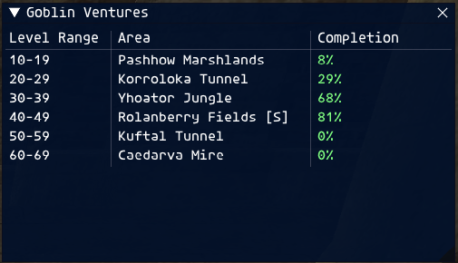
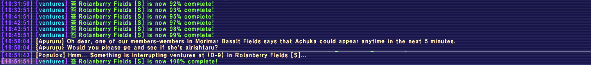

# 📊 Goblin Ventures (Ashita Addon)

> Easily track Goblin Venture EXP areas in FFXI. Automatically pulls the latest data, alerts you when zones are near completion, and shows it all in a clean GUI.

---



---

## ✨ Features

- 📈 Automatically captures and parses EXP Area data from `!ventures`
- 🪧 Displays level range, area name, and completion percentage
- 🟢 Auto-refreshes every 60 seconds (configurable)
- 🚨 Alerts you in chat when a zone crosses **90% completion**
- 🚫 Prevents spamming alerts — only alerts **if % increased**
- 🧠 Skips refresh if you are zoning — and **retries automatically** after 5 seconds
- 🎨 GUI with styled columns (toggleable)
- 🛠 Settings interface to control GUI & Alerts

---

## 💬 In-Game Commands

| Command | Description |
|--------|-------------|
| `/ventures` | Generates a popup to configure your settings |
| `/ventures config` | Generates a popup to configure your settings |
| `/ventures force` | Immediately fetches the latest Venture data |
| `/ventures settings` | Shows the current GUI and Alert settings |
| `/ventures settings gui` | Toggles the GUI display ON/OFF |
| `/ventures settings alerts` | Toggles command-line alerts ON/OFF |
| `/ventures settings audio` | Toggles audio alerts ON/OFF |

---

## 🔁 Auto Refresh

- The addon will automatically call `!ventures` every **60 seconds**  
- You can change the interval by modifying this in the code:
  ```lua
  auto_refresh_interval = 60 -- seconds
  ```

---

## 🚨 Example Alert

When an EXP area crosses the alert threshold (default: 90%), you will see:



You will only be alerted once per increase — no spam!

---

## 🧠 Zoning Detection

If the addon detects that you're zoning (zone ID = 0), it will:

- Skip the current `!ventures` call
- Print a small message: `Zoning detected. Will retry shortly...`
- Retry automatically after 5 seconds

---

## 🧪 Notes

- Only EXP Areas are currently parsed
- Completion is pulled from in-game `!ventures` system
- Supports both **manual** and **auto** refresh
- Does not require any external tools or plugins

---

## ✅ To-Do / Planned Features

- [ ] Estimated time until 100% completion
- [ ] Popup notification when zones reach 90%+
- [ ] Configurable alert threshold
- [ ] Persist settings between sessions
- [ ] Settings GUI

---

## 🙏 Credits

Built by **Commandobill** 

Contributions by **Seekey** & **Phatty**

Tested on private server environments. Feedback and contributions welcome!
